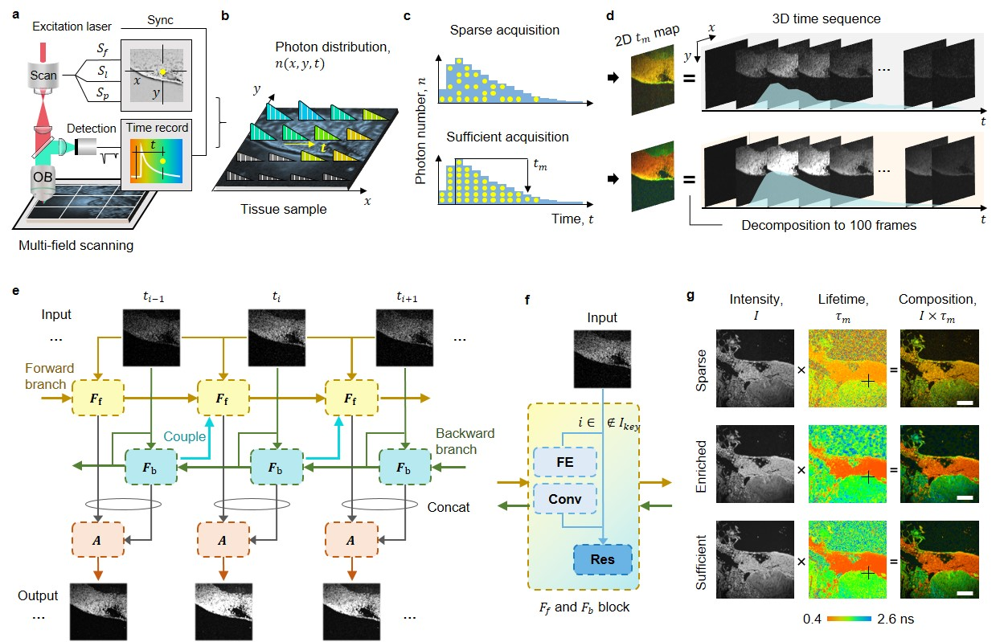
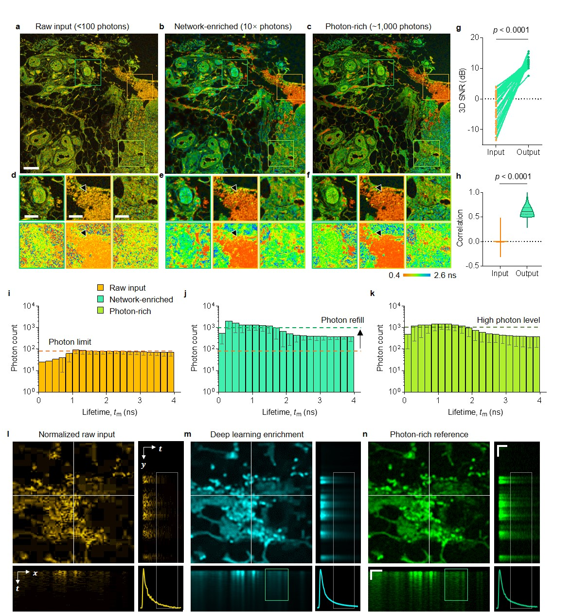

#  SparseFLIM: Overcoming Photon and Spatiotemporal Sparsity in Fluorescence Lifetime Imaging

### [Paper](assets/Manuscript.pdf)
This project hosts the scripts for training and testing SparseFLIM, an intelligent paradigm for achieving high-fidelity FLIM reconstruction from sparse photon measurements, as presented in our paper.

## Contents

- [Introduction](#Introduction)
- [Network](#Network)
- [Dataset](#Dataset-download)
- [Train and Test](#Train-and-Test)
- [Results](#Results)
- [License](#License-and-Acknowledgement)
- [Citation](#Citation)

## Introduction

Fluorescence lifetime imaging microscopy (FLIM) provides quantitative readouts of biochemical microenvironments, holding great promise for biomedical imaging. However, conventional FLIM relies on slow photon counting routines to accumulate sufficient photon statistics, restricting acquisition speeds. Here we demonstrate SparseFLIM, an intelligent paradigm for achieving high-fidelity FLIM reconstruction from sparse photon measurements. We develop a coupled bidirectional propagation network that enriches photon counts and recovers hidden spatial-temporal information. Quantitative analysis shows over tenfold photon enrichment, dramatically improving signal-to-noise ratio, lifetime accuracy, and correlation compared to the original sparse data. SparseFLIM enables reconstructing spatially and temporally undersampled FLIM at full resolution and channel count. The model exhibits strong generalization across experimental modalities including multispectral FLIM and in vivo endoscopic FLIM. This work establishes deep learning as a promising approach to enhance fluorescence lifetime imaging and transcend limitations imposed by the inherent codependence between measurement duration and information content. The approach unlocks the potential of lifetime imaging microscopy for widespread biomedical applications by extracting hidden information from sparse data at high speed.

## General principle and validation of SparseFLIM 

<p align="center">
  
</p>
<p align="center">
  
</p>

## Network
📕 Dependencies and Installation

Python 3.9 (Recommend to use [Anaconda](https://www.anaconda.com/download/#linux))
- NVIDIA GPU + [CUDA](https://developer.nvidia.com/cuda-downloads)

1. Clone repo

    ```bash
    git clone https://github.com/shenblin/DeepBID.git
    ```

2. Install dependent packages

    ```bash
    pip install -r requirements.txt
    pip3 install torch==1.9.0+cu111 torchvision==0.10.0+cu111 torchaudio==0.9.0 -f https://download.pytorch.org/whl/torch_stable.html
    python setup.py develop
    ```
    
## Dataset download

Please refer to [DataPreparation](datasets/Data_Download.md). It mainly includes experimental data for training and testing.

## Train and Test

⚡  **Training and testing commands**: We provide an operable [SH file](run_FLIM3D.sh) for Ubuntu that contains the following commands. Alternatively, these commands can be run on Windows and Ubuntu bashs.
For single gpu, use the following commands as example:
1. **Training**

    Photon sparsity
    ```bash
    python basicsr/train.py -opt options/FLIM3D/FLIM3D_PECBNet_train.yml
    ```
   Spatial sparsity
    ```bash
   python basicsr/train.py -opt options/FLIM3D/FLIM3D_PECBNet_downsampling_train.yml
    ```
    Temporal sparsity
    ```bash
    python basicsr/train.py -opt options/FLIM3D/FLIM3D_PECBNet_temporal_sparsity_train.yml
    ```

2. **Testing**
     
    Photon sparsity
    ```bash
    python basicsr/test.py -opt options/FLIM3D/FLIM3D_PECBNet_test.yml
    ```
    Spatial sparsity
    ```bash
    python basicsr/test.py -opt options/FLIM3D/FLIM3D_PECBNet_downsampling_test.yml
    ```
   Temporal sparsity
    ```bash
    python basicsr/test.py -opt options/FLIM3D/FLIM3D_PECBNet_temporal_sparsity_test.yml
     ```


## Results
__________________________________________________________________________________________________________________________________


<p align="center">
  
</p>

**Fig. 2  Network enhance label-free FLIM data of human skin tissue.**

__________________________________________________________________________________________________________________________________

📢 **For more results and further analyses, please refer to our paper.**

## License and Acknowledgement

📜 This project is released under the [Apache 2.0 license](license/LICENSE.txt).<br>
More details about **license** and **acknowledgement** are in [LICENSE](license/README.md).

 ## Citation

🌏 If you find this work useful in your research, please consider citing the paper:

B. Shen, et al.

📧 Contact

If you have any questions, please email `shenblin@foxmail.com`.
